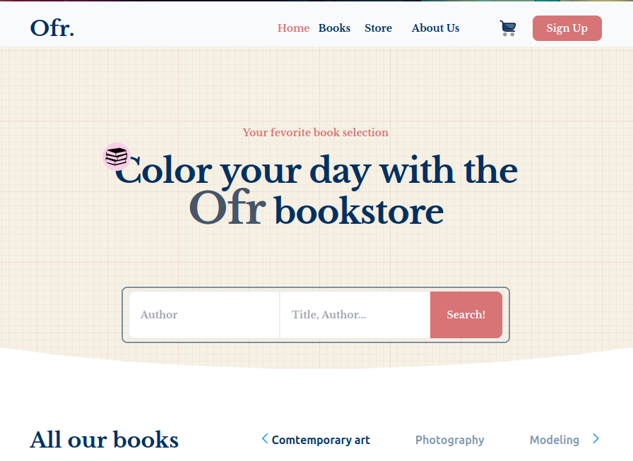

# Ofr. Bookstore 📚

This project was created for learning purposes, utilizing Vue.js and Tailwind CSS. The UI design was inspired by Dribbble.

## Project Overview

## Technologies Used

- **Vue with Vite:** Learning Vue's reactivity and Vite's fast development workflow.
- **Tailwind CSS and PostCSS:** Exploring rapid UI development with Tailwind's utility-first approach.

## Project Setup

1. Install dependencies: `npm install`
2. Run for Development: `npm run dev`
3. Build for Production: `npm run build`
4. Lint with ESLint: `npm run lint`

## License

This project is licensed under the [MIT License](LICENSE).
